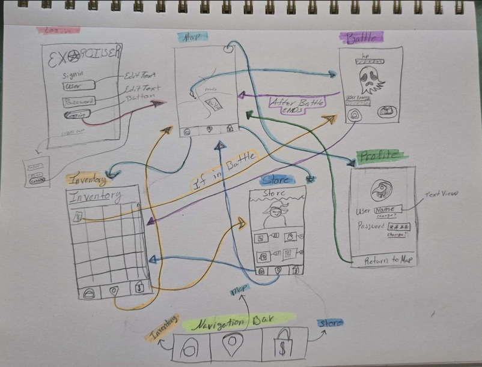
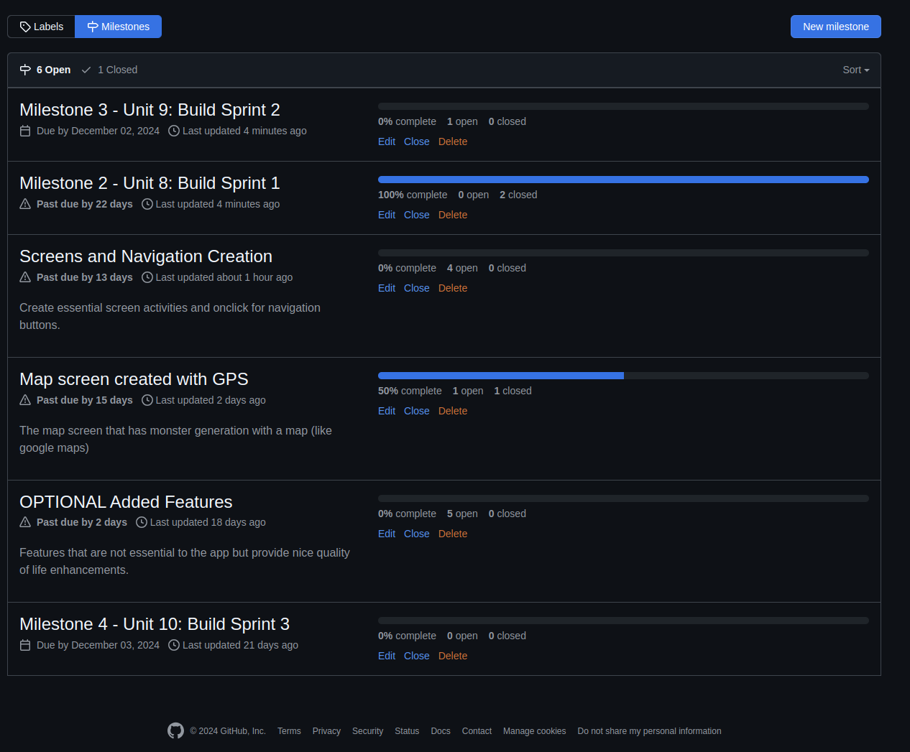
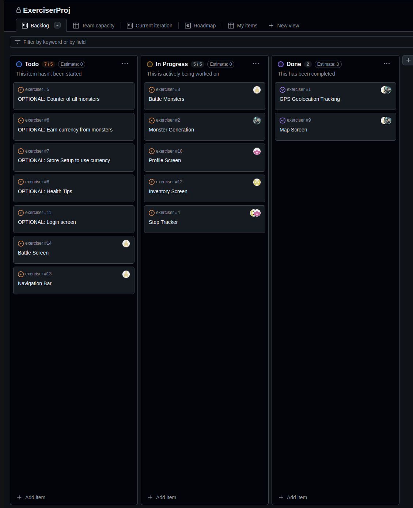
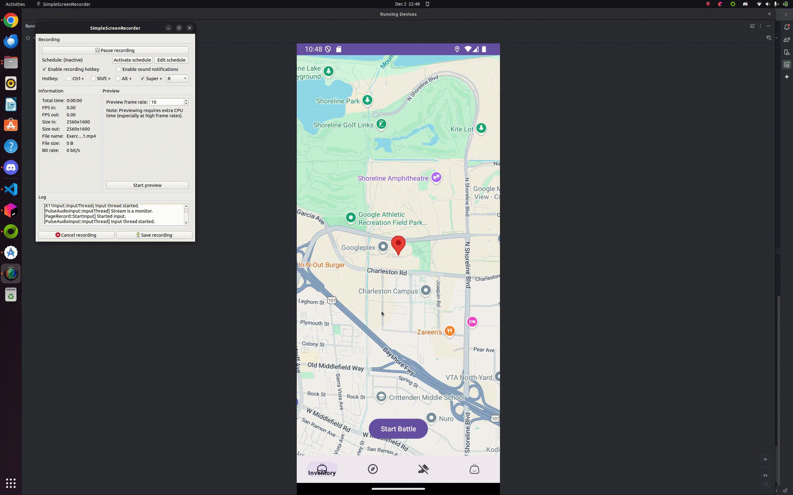

# Milestone 1 - Exerciser (Unit 7)

## Table of Contents

1. [Overview](#Overview)
1. [Product Spec](#Product-Spec)
1. [Wireframes](#Wireframes)

## Overview

### Description

Exerciser is a mobile app game that is meant to promotes health and entertainment. The user is to walk around their areas to defeat enemies in the app and earn rewards, allowing for a friendly and heroic environment for those who wish to improve their physical health while enjoying their time doing so.

### App Evaluation

[Evaluation of your app across the following attributes]
- **Category:** Health and Entertainment
- **Mobile:** Uses mobile location to track the position of users device and to asist in step count tracking.
- **Story:** Allows user to play a game while they are working on their physical health.
- **Market:** Users looking for a chance to add light excerise of walking to their day while also wanting something to bring entertainment on that walk.
- **Habit:** Users can use the app at anytime. After defeating enemies of the game users are rewarded in-game currency, that can be spent on in-game rewards. Users can create and edit their profile.
- **Scope:** V1 would allow the user icon to move around on a map based off of their devices phyical location. V2 would allow profile customisation and randomised battle locations that are activated when the users device location is near the battle , as well as a in-app steps counter. V3 would allow rewards and coins for the user after battles(implimentation of in-game currency) and a small in-game store to spend coins, and a health tip section to assist users on their technics. V4 would have a timer for break reminds so users don't overwork themselves. (other customisation additions or social additions possibly but not focused)

## Product Spec

### 1. User Features (Required and Optional)

**Required Features**

1. GPS Geolocation Tracking
2. Monster Generation
3. Battle Monsters
4. Step Tracker

**Optional Features**

1. Counter of all monsters 
2. Earn currency from monsters
3. Store Setup to use currency
4. Health Tips

### 2. Screen Archetypes

- User Login
  - Users can enter their info into this screen to access their account. 
  - Will take username and password. 
- Map Screen
  - Will use geolocation to track user location. 
  - When walking, users will encounter generated monsters.
  - When using this screen, step counting feature will be engaged.
  - When encountering monsters, users will be taken to battle screen. 
- Battle Screen
  - Will show sprite of monster you are battling.
  - Under sprite, details of monster will be displayed. 
  - User can use different spell books to defeat monster. 
- Store Screen
  - Using coins earned from battle, users can buy items in the store.
  - These items may include game cosmetics, exorcism items, and more.
  - Items will be shown in inventory. 
- Inventory
  - Will contain items purchased from store.

### 3. Navigation

**Tab Navigation** (Tab to Screen)

* Map Screen Navigation
* Inventory Screen Navigation
* Store Screen Navigation

**Flow Navigation** (Screen to Screen)

- Login Screen. User enters details and it takes them to map screen. 
  - Map screen will be the homepage of the app. This will show the users location and movement. 
    - Battle screen will appear when user enteracts with a monster sprite on the map.  
- When pressing inventory tab navigation, Inventory will show purchased items and current amount of coins from exorcisms. 
- When pressing store tab navigation, Store screen will show items available for purchase. 

## Wireframes

 

 

### [BONUS] Digital Wireframes & Mockups

### [BONUS] Interactive Prototype

 

# Milestone 2 - Build Sprint 1 (Unit 8)

## GitHub Project board

[Add screenshot of your Project Board with three milestones visible in
this section]

## Issue cards

## Issues worked on this sprint

- Issues Completed:
  1) Map Screen
  2) GPS location

 

# Milestone 3 - Build Sprint 2 (Unit 9)

## GitHub Project board

[Add screenshot of your Project Board with the updated status of issues for Milestone 3. Note that these should include the updated issues you worked on for this sprint and not be a duplicate of Milestone 2 Project board.] 

## Completed user stories

- List the completed user stories from this unit
- List any pending user stories / any user stories you decided to cut
from the original requirements

[Add video/gif of your current application that shows build progress]

## App Demo Video

- Embed the YouTube/Vimeo link of your Completed Demo Day prep video
